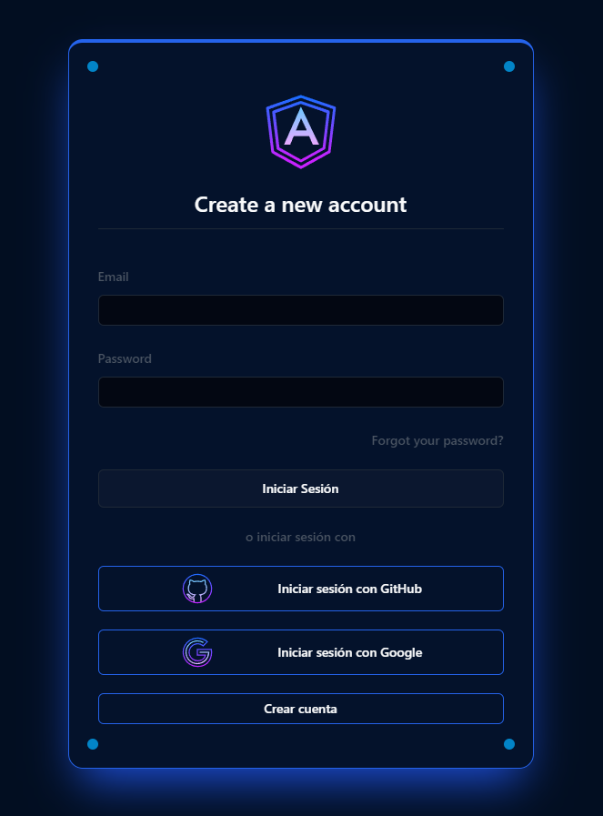
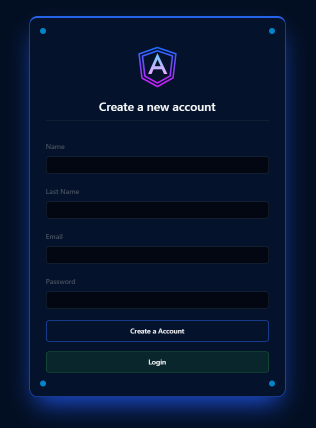
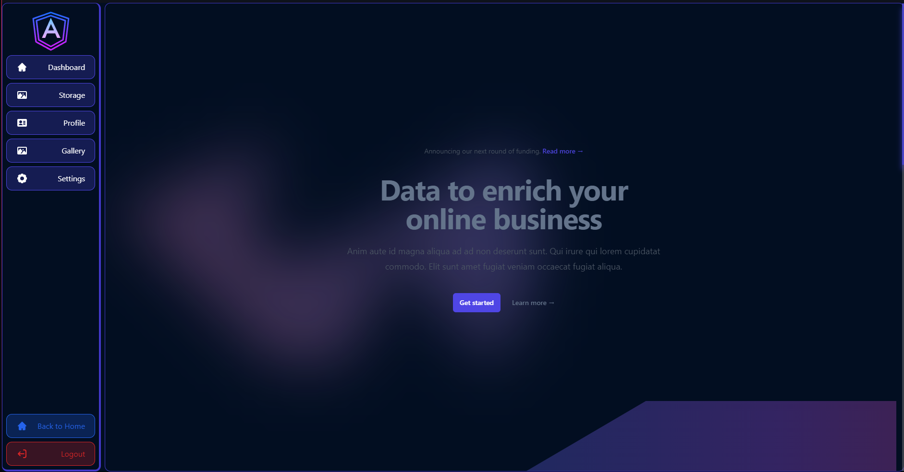
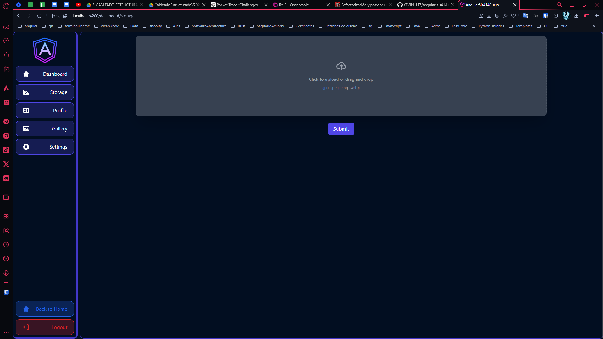
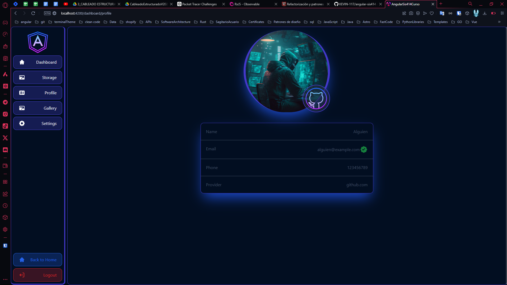

# A Simple Example of Authentication with AngularJS using  Firebase Authentication
This is a simple example of how to authenticate with AngularJS using Firebase Authentication. This example uses the email and password authentication method.

## Authentication Methods

- Email and Password: This is the method used in this example. the user provides an email and password to sign in.

- Google: The user signs in with a Google account.
- GitHub: The user signs in with a GitHub account.
- Register: The user creates an account with an email and password.

## How to Run the Application

1. Clone the repository.
2. Run `npm install` to install the dependencies.
3. Run `npm start` to start the application.
4. Open the browser and navigate to `http://localhost:3000`.

## Technologies Used

- AngularJS
- Firebase Authentication
- Tailwind CSS

## Screenshots

### Sign In Page

### Register Page

### Dashboard Page

### Storage Page

### Profile Page

- google account

- github account

- email and password account

